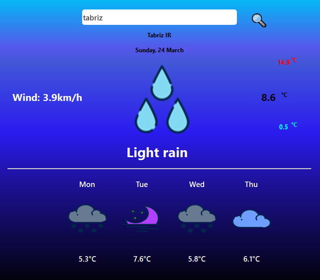
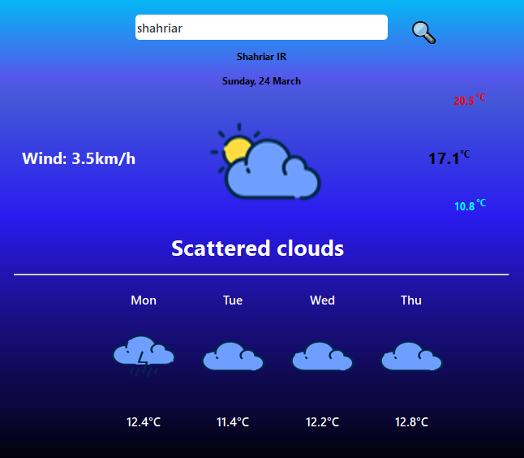

# Weather App  


    

    


#### I designed the front end using PySide6 and implemented the back end of the software using the Python programming language.

## How to run

```
python weather.py
```

## Results







