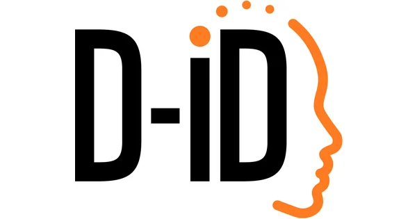

# API

## API with Authentication


- [Iconfinder](https://developer.iconfinder.com/reference/overview-1)

 Iconfinder Overview Iconfinder is the world's largest marketplace for icons, illustrations, and 3D illustrations in SVG, AI, and PNG formats. It offers a wide selection of high-quality icons for web designs, apps, and presentations.


- [D-iD.com](https://docs.d-id.com/reference/overview-2)

D-ID Overview D-ID is an AI video generation platform that allows users to create realistic videos of people from a single image. The platform uses generative AI to create videos that are indistinguishable from real footage.



- [Illusion Diffusion](https://fal.ai/models/illusion-diffusion/api)

Illusion-diffusion is a term used in psychology to describe a phenomenon where a person's perception of an illusion is influenced by the presence of other people. In other words, when individuals view an illusion in a group setting, their perception of the illusion may be influenced by the reactions and interpretations of others around them. This can lead to a shared experience of the illusion that may differ from how an individual would perceive it in isolation.


- [Pl@ntNetAPI](https://my.plantnet.org/doc/openapi)

Pl@ntNet is a citizen science project for automatic plant identification through photographs and based on machine learning.


## FastAPI Hello World!
Simple FastAPI server-side and client-side scripts.

### How to run server-side

```
uvicorn server:app --reload
```

### How to run client-side

```
python client.py
```


## AI-Generated Image Plant Identifier