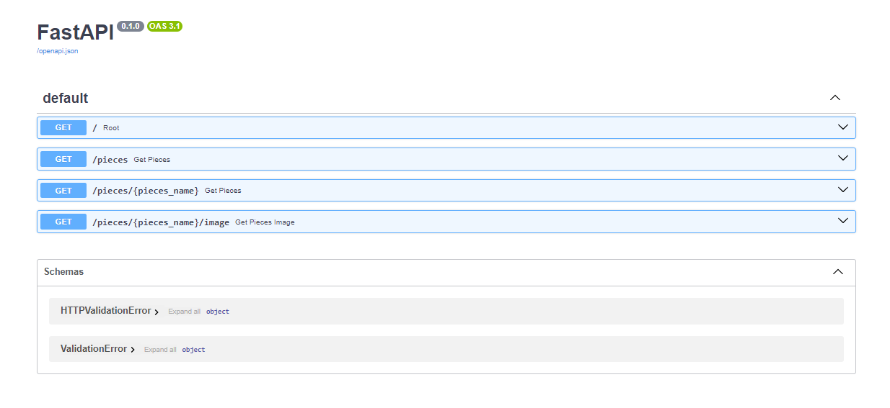

# Hello FastAPI


.png>)


## How to run 

```
uvicorn filename:app --reload
```

for example:

```
uvicorn main:app --reload
```

# Used

Uvicorn running on http://127.0.0.1:8000 (Press CTRL+C to quit)

#  Chess API

The link of the site to use this [chess api](https://deployment-1bw8.onrender.com/)



